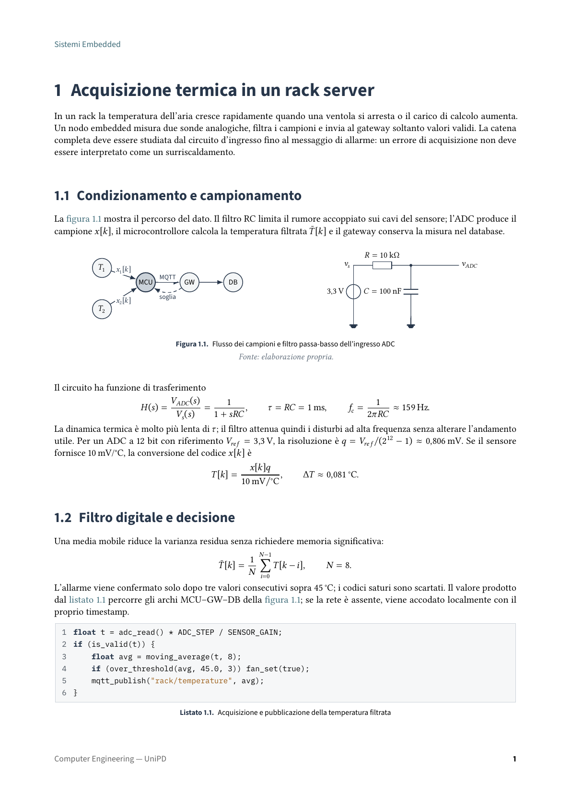

<p align="center">
  
</p>

<h1 align="center">UniPD Computer Engineering</h1>

<p align="center">
  <strong>A structured archive of course notes and academic material for the bachelor's degree in Computer Engineering at the University of Padua.</strong>
</p>

<p align="center">
  <em>An unofficial, student-maintained project not affiliated with or endorsed by the University of Padua.</em>
</p>

<p align="center">
  <a href="https://www.unipd.it/corsi-di-laurea/ingegneria-informatica">
    
  </a>
  <a href="LICENSE">
    
  </a>
  <a href="LICENSE-MIT">
    
  </a>
  <a href="#exams-covered">
    
  </a>
</p>

<p align="center">
  <a href="https://www.unipd.it/"><strong>University of Padua</strong></a>
  &nbsp;·&nbsp;
  <a href="https://www.unipd.it/corsi-di-laurea/ingegneria-informatica"><strong>Computer Engineering degree programme</strong></a>
</p>

## Contents

- [Notes preview](#notes-preview)
- [Overview](#overview)
- [Browse the notes](#browse-the-notes)
- [Exams covered](#exams-covered)
- [Quick start](#quick-start)
- [Documentation](#documentation)
- [AI-assisted development](#ai-assisted-development)
- [Contributing](#contributing)
- [Academic disclaimer](#academic-disclaimer)
- [License](#license)
- [Contributors](#contributors)

## Notes preview

<p align="center">
  
</p>

The preview shows a representative page from the archive, demonstrating the shared layout for headings, text, diagrams, equations, cross-references, source notes, and code listings.

## Overview

This repository is a long-term academic archive for the three-year Bachelor's degree programme in Computer Engineering at the University of Padua.

It collects notes, summaries, diagrams, exercises, references, and other study material produced throughout the degree. Courses are organized by degree year and use a shared LaTeX system to keep their structure, typography, metadata, and compiled PDFs consistent.

The archive serves both as an active study workspace and as a record of the material covered for each exam.

## Browse the notes

Choose the directory corresponding to your degree year:

| Degree year | Course directory |
|---|---|
| First year | [`1/`](1/) |
| Second year | [`2/`](2/) |
| Third year | [`3/`](3/) |

Inside each course directory, open or download `main.pdf` to access the latest compiled notes. The LaTeX sources and supporting files are available alongside the PDF. Weekly generated changelogs under [`CHANGELOG/`](CHANGELOG/) record committed course-file changes, grouped by date and linked to the corresponding commit.

## Exams covered

The archive is updated as new material is written, reviewed, and completed. An exam is considered **covered** only when its intended notes are sufficiently complete, have been reviewed, and have been approved by the repository maintainer.

| Degree year | Exams covered |
|---|---:|
| First year | 0 |
| Second year | 0 |
| Third year | 0 |
| **Total** | **0** |

Current covered exams:

| Year | Exam | Course archive | Compiled notes |
|---:|---|---|---|
| — | _No exams covered yet_ | — | — |

## Quick start

Clone the repository, then build a course in the pinned TeX Live environment used by CI. Replace `1/course-name` with the course path you want to build.

```bash
git clone https://github.com/simonesiega/unipd-computer-engineering.git
cd unipd-computer-engineering
docker compose run --rm texlive python3 latex/tools/build.py 1/course-name
```

The canonical build requires Docker Compose. Native TeX installations remain useful for previews, but PDFs to be committed must be regenerated in the pinned container. See [Installation](docs/md/getting-started/installation.md) for prerequisites, [Docker builds](docs/md/getting-started/docker.md) for container setup and troubleshooting, and [Building documents](docs/md/getting-started/building-documents.md) for build options.

## Documentation

The [documentation hub](docs/md/README.md) is the main reference for using, building, and extending the archive.

| Area | Guides |
|---|---|
| Getting started | [Installation](docs/md/getting-started/installation.md) · [Docker builds](docs/md/getting-started/docker.md) · [Creating a course](docs/md/getting-started/creating-a-course.md) · [Building documents](docs/md/getting-started/building-documents.md) |
| Writing notes | [Course structure](docs/md/user-guide/course-structure.md) · [Writing notes](docs/md/user-guide/writing-notes.md) · [Metadata](docs/md/user-guide/metadata.md) |
| LaTeX reference | [Document class](docs/md/reference/unipd-notes-class.md) · [Components](latex/components/README.md) · [Fonts](latex/fonts/README.md) |
| Repository internals | [Architecture](docs/md/development/architecture.md) · [Build system](docs/md/development/build-system.md) · [Validation, Tests, and CI](docs/md/development/tool-test-and-ci.md) |
| Project policies | [Contributing](CONTRIBUTING.md) · [Report a problem](CONTRIBUTING.md#getting-help-and-reporting-problems) · [Security](SECURITY.md) |

## AI-assisted development

This repository may use AI-assisted tools to help write, review, build, test, and maintain course material and supporting infrastructure. AI output is never treated as authoritative by itself: every contribution remains subject to human review for accuracy, clarity, originality, citations, licensing, academic integrity, and consistency with the surrounding material.

Repository-specific instructions for compatible AI coding agents are stored in [`AGENTS.md`](AGENTS.md) and [`.agents/skills/`](.agents/skills/).

`AGENTS.md` defines the shared rules and routes each task to the most appropriate skill, while each `SKILL.md` contains a focused workflow for one area of the project.

| File | Responsibility |
|---|---|
| [`AGENTS.md`](AGENTS.md) | Defines repository-wide rules, protected generated content, academic and licensing constraints, skill routing, normal workflows, and completion reporting. |
| [`.agents/skills/unipd-note-writing/SKILL.md`](.agents/skills/unipd-note-writing/SKILL.md) | Writes and reviews course-specific prose, mathematics, examples, exercises, solutions, references, code explanations, and diagrams stored with course sources. |
| [`.agents/skills/unipd-latex-component-development/SKILL.md`](.agents/skills/unipd-latex-component-development/SKILL.md) | Develops the shared document class, LaTeX components, component examples, fonts, public interfaces, dependencies, and related documentation. |
| [`.agents/skills/unipd-python-tool-development/SKILL.md`](.agents/skills/unipd-python-tool-development/SKILL.md) | Develops, fixes, reviews, and tests Python repository tools while preserving the standard-library `unittest` architecture and deterministic isolated tests. |
| [`.agents/skills/unipd-latex-build/SKILL.md`](.agents/skills/unipd-latex-build/SKILL.md) | Selects and compiles affected documents, diagnoses LaTeX failures, and regenerates PDFs and other build-owned outputs. |
| [`.agents/skills/unipd-pdf-review/SKILL.md`](.agents/skills/unipd-pdf-review/SKILL.md) | Visually reviews generated PDFs for layout, readability, navigation, clipping, overlap, page-break, and rendering problems. |
| [`.agents/skills/unipd-repository-validation/SKILL.md`](.agents/skills/unipd-repository-validation/SKILL.md) | Runs and diagnoses repository validation, pre-commit checks, structural rules, source hygiene, YAML, encoding, whitespace, and line-ending failures. |

These files guide AI-assisted work but do not replace the project documentation, validation tools, contribution requirements, or maintainer review. Contributors remain responsible for every submitted change and must disclose uncertainty, skipped checks, unavailable tools, and material that still requires verification.

## Contributing

Contributions to the study materials, LaTeX system, documentation, and repository tooling are welcome. Before opening an issue or pull request, read [`CONTRIBUTING.md`](CONTRIBUTING.md) for contribution paths, quality standards, licensing requirements, validation steps, and academic-integrity rules.

Security vulnerabilities involving scripts, dependencies, automation, or configuration should be reported according to [`SECURITY.md`](SECURITY.md).

## Academic disclaimer

This is an independent and unofficial repository. It is not affiliated with, maintained by, or endorsed by the University of Padua.

The materials may contain errors, incomplete explanations, missing topics, personal interpretations, outdated information, or inaccurate AI-assisted content. They are intended to complement lectures and official course resources, not replace them, and are provided without guarantees of accuracy, completeness, or suitability for a particular academic purpose.

Always verify important information against official university resources, course instructors, syllabi, textbooks, and teaching materials. The University of Padua name, logo, and related marks are the property of their respective owners. The logo is displayed solely to identify the institution associated with the degree programme; its use does not imply affiliation, authorization, or endorsement.

## License

| Material | License |
|---|---|
| Study notes and academic materials under `1/`, `2/`, and `3/`, including LaTeX sources and compiled PDFs | [CC BY-SA 4.0](LICENSE) |
| Shared LaTeX system, build and validation tools, documentation, CI configuration, and other supporting project files | [MIT](LICENSE-MIT) |

Third-party fonts, assets, and other bundled resources remain subject to their respective licenses. Font licensing information is available in [`latex/fonts/FONT-LICENSE.md`](latex/fonts/FONT-LICENSE.md).

## Contributors

<p align="center">
  <a href="https://github.com/simonesiega/unipd-computer-engineering/graphs/contributors">
    
  </a>
</p>
